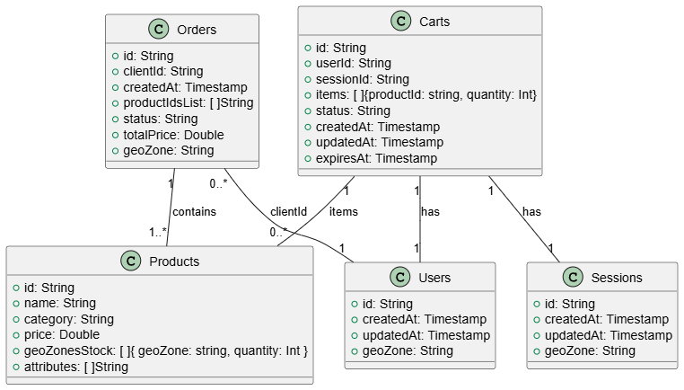

# Задание 7. Проектирование схем коллекций для шардирования данных

### Схема коллекций Orders, Products, Carts


### Потенциальные кандидаты для шард-ключей
Orders
- geoZone - при равномерном распределении товаров будет наилучшим шард ключом если шарды имеют географическое размещение вместе с приложением, в этом случае уменьшить время отклика
- totalPrice - если правильно подобрать средние интервалы по шардам то получится хороший ключ равномерно распределяющий нагрузку, 0-100, 100-1000, 2000+
- productIdsList - по количеству товаров в заказах можно подобрать интервалы для распреледения по шардам, 1-2, 3-6, 6+

Products
- geoZonesStock - можно использовать геозону и количество товаром в геозоне для шардирования
- price - если правильно подобрать средние интервалы по шардам то получится хороший ключ равномерно распределяющий нагрузку, 0-100, 100-500, 1000+
- category - выделить списки по частоте товаров и разбить на шарды, (электроника), (одежда, товары для дома)

Carts
- itemsCount - можно добавить поле количество товаров в корзине и подобрать интервалы для распреледения по шардам, 1-2, 3-6, 6+
- geoZone of userId/sessionId - при большом количестве геораспределённых пользователей
- id - использовать hash для равномерного распределения т.к id является уникальным значением

### Выбранные шард-ключи
Выбраны ключи которые определяются статистически статистику можно равномерно распределить нагрузку на шарды
Orders
- totalPrice

Products
- price

Carts
- id


### Комманды для создание коллекций и шард ключей
```shell
db.createCollection("orders");

// Ensure an index exists on the field
db.orders.ensureIndex({ totalPrice: 1 });

// Shard the collection using as the shard key
sh.shardCollection("somedb.orders", { totalPrice: 1 });

// Add shards to zones
sh.addShardToZone("shard1", "low_price_zone");
sh.addShardToZone("shard2", "mid_price_zone");
sh.addShardToZone("shard3", "high_price_zone");

// Define ranges for each zone
sh.updateZoneKeyRange(
    "orders",
    { totalPrice: { $minKey: 1 } },
    { totalPrice: 100 },
    "low_price_zone"
);
sh.updateZoneKeyRange(
    "orders",
    { totalPrice: 100 },
    { totalPrice: 1000 },
    "mid_price_zone"
);
sh.updateZoneKeyRange(
    "orders",
    { totalPrice: 2000 },
    { totalPrice: { $maxKey: 1 } },
    "high_price_zone"
);

db.createCollection("products");

// Enable sharding for the database
sh.enableSharding("yourDatabase");

// Ensure an index exists on the field
db.products.ensureIndex({ price: 1 });

// Shard the collection using as the shard key
sh.shardCollection("yourDatabase.products", { price: 1 });

// Add shards to zones
sh.addShardToZone("shard1", "low_price_zone");
sh.addShardToZone("shard2", "mid_price_zone");
sh.addShardToZone("shard3", "high_price_zone");


// Add shards to zones
sh.addShardToZone("shard1", "low_price_zone");
sh.addShardToZone("shard2", "mid_price_zone");
sh.addShardToZone("shard3", "high_price_zone");

// Define ranges for each zone
sh.updateZoneKeyRange(
    "products",
    { price: { $minKey: 1 } },
    { price: 100 },
    "low_price_zone"
);
sh.updateZoneKeyRange(
    "products",
    { price: 100 },
    { price: 500 },
    "mid_price_zone"
);
sh.updateZoneKeyRange(
    "products",
    { price: 501 },
    { price: { $maxKey: 1 } },
    "high_price_zone"
);

db.createCollection("carts");
sh.shardCollection("somedb.carts", { "id" : "hashed" } )
```

# Задание 8. Выявление и устранение «горячих» шардов

### Набор метрик для отслеживания состояния шардов
Операционные метрики

- Queries per second (QPS) - остлеживать количество запросов к каждому шарды для определения неравномерной загрузки и узких мест
- Connections - количество активных соединений для понимания доступности ресурсов
- Queues - количество операций в очереди для выявления потенциальных проблем
- Read/Write - чтение запись для определения схем доступа и активно используемых шардов

```shell
db.serverStatus()
```

Метрики распределения данных и балансировщика

- Chunk Distribution - равномерность распределения блоков данных по шардам для выявления дисбаланса
- Balancer Activity - частота и продолжительность миграции блоков данных, выполняемой балансировщиком, для обеспечения эффективной балансировки нагрузки
- Jumbo Chunks - блоки данных, размер которых превышает максимальный и может потребовать ручного вмешательства.
- Split Operations - скорость разделения блоков данных, что позволяет оценить рост объёма данных и потенциал

```shell
sh.status()

db.collection.getShardDistribution();
```

### Механизмы автоматического перераспределения данных
Для автоматического перераспределения данных можно испольщовать Balancer

```shell
sh.balancerCollectionStatus()
sh.startBalancer()
db.settings.update(
   { _id: "balancer" },
   { $set: { activeWindow : { start : "<start-time>", stop : "<stop-time>" } } },
   { upsert: true }
)
```

# Задание 9. Настройка чтения с реплик и консистентность

### Основные операции orders:
| Operation | Replica | Comment
|:-|:-:|:-:|
| Быстрое создание заказов с одновременным списанием остатков | Primary | Операция записи
| Поиск истории заказов конкретного пользователя | Secondary | Допустима задержка 1-10 секунд, не требуется высокая консистентность для исторических данных
| Отображение статуса заказа | Primary | Важная информация для пользователя, требуется минимальная задержка и максиальная консистентность данных для избежения путаницы

### Основные операции products:
| Operation | Replica | Comment
|:-|:-:|:-:|
| Частые обновления остатков при покупках | Primary | Операция записи
| Поиск товаров по категориям и фильтрация по диапазону цен | Primary | Важная информация которая напрямую вляет на заказы пользователя, требуется минимальная задержка и максиальная консистентность данных для избежения путаницы
| Описание товара на странице продукта | Primary | Важная информация которая напрямую вляет на заказы пользователя, требуется минимальная задержка и максиальная консистентность данных для избежения путаницы

### Основные операции carts:
| Operation | Replica | Comment
|:-|:-:|:-:|
| Создание корзины, когда заходит гость или новый пользователь | Primary | Операция записи
| Получение текущей корзины по фильтру { session_id, status:"active" } или { user_id, status:"active" }. | Primary | Важная информация для пользователя, требуется минимальная задержка и максиальная консистентность данных для избежения путаницы
| Добавление или замена товара в корзине | Primary | Операция записи
| Удаление товара из корзины | Primary | Операция записи
| Слияние гостевой корзины в пользовательскую, если пользователь залогинится, прочитать гостевую | Primary | Операция записи
| Слияние гостевой корзины в пользовательскую, если пользователь залогинится, добавить её items в корзину { user_id, status:"active" }; | Primary | Операция записи
| Слияние гостевой корзины в пользовательскую, если пользователь залогинится, отметить гостевую как abandoned | Primary | Операция записи
| Отметка корзины как заказанной | Primary | Операция записи
